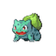
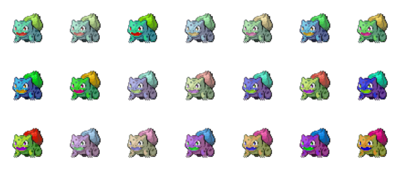

# Pokemon Sprite Downloading and Augmenting
## Made by Mateusz Kolinski MateuszPKolinski@gmail.com

Pokemon sprite images are downloaded from https://pokemondb.net/sprites
Only generation 3, 4, 5 and 6 Pokemon sprites are selected. Older and newer sprites have very different art styles.

After downloading, sprites are augmented (hue and saturation changes, then mirror image) and finally converted to 32-bit images for use in neural networks.

Example of the process:

1. Download base sprite
   

2. Resize sprite to a custom size (96 by 96 by default, since most sprites are of that size)

3. Augment by changing saturation and hue

4. Augment by mirror imaging

5. Convert images from 4-bit to 32-bit (4-bit images are hard to work on in terms of alpha channel)
